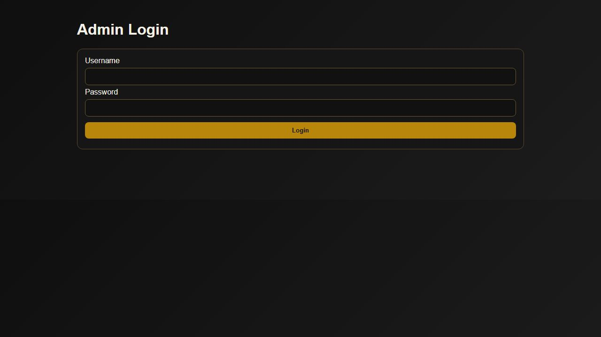

# Split Sheet Open Sign

Fast local signing app for split sheets and core studio legal forms.

Primary goal
When a song is finished, open this app immediately, capture legal splits and signatures, and send copies to both parties plus studio records.

## What it does
- Split Sheet workflow with contributor validation
- Sync Collaboration Agreement form
- Work for Hire Agreement form
- Drawn + typed signature capture
- Split validation for writer and publisher totals
- Email notifications to contributors and studio inbox when SMTP is configured
- PDF summary export for split sheets
- Admin panel to review submitted documents

## UI Screenshots

### Home


### Split Sheet workflow


### Admin access


## Quick start
1. Copy `.env.example` to `.env`
2. Set SMTP and admin values
3. Install dependencies
4. Start app

```powershell
cd C:/Users/User/Documents/Openclaw/split-sheet-open-sign
npm install
npm run dev
```

Local URL: `http://localhost:5050`
LAN URL: `http://<your-computer-ip>:5050`

## Important env settings
- `ADMIN_USER` and `ADMIN_PASS` for admin access
- `SMTP_USER` and `SMTP_PASS` for outbound email
- `NOTIFY_EMAIL` for studio archive inbox

## Data and storage
- Submissions are stored in `data/submissions/*.json`
- Split sheet PDF export route: `/split-sheet/pdf/:id`

## Recommended studio workflow
1. Open Split Sheet from home screen
2. Add all contributors and signatures in-session
3. Confirm writer and publisher totals are each exactly 100
4. Confirm at least two recipient emails are checked
5. Submit immediately before artist leaves
6. Use admin panel to audit and export records

## Product expansion roadmap
- Add form templates for producer agreement and beat license
- Add session presets so frequent collaborators auto-fill quickly
- Add signer confirmation links with immutable final PDF archive
- Add role based studio permissions and optional cloud backup
- Add artist portal for agreement history and re-downloads
