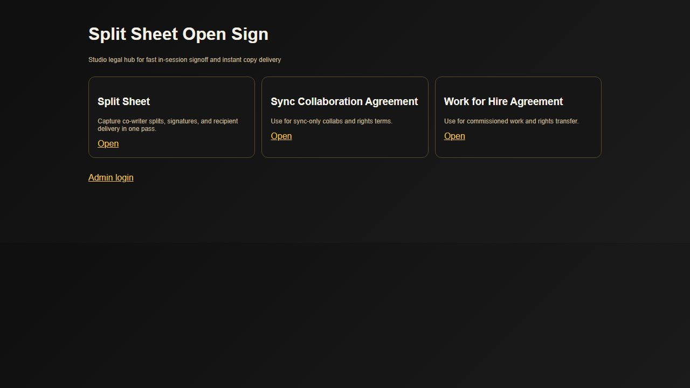
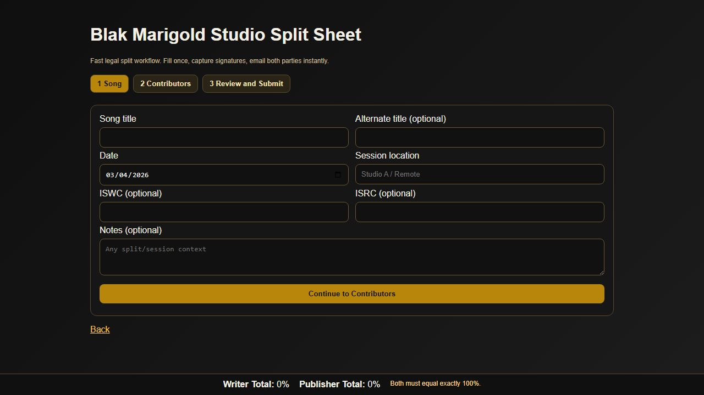
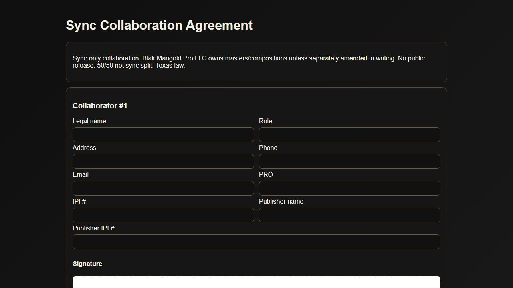
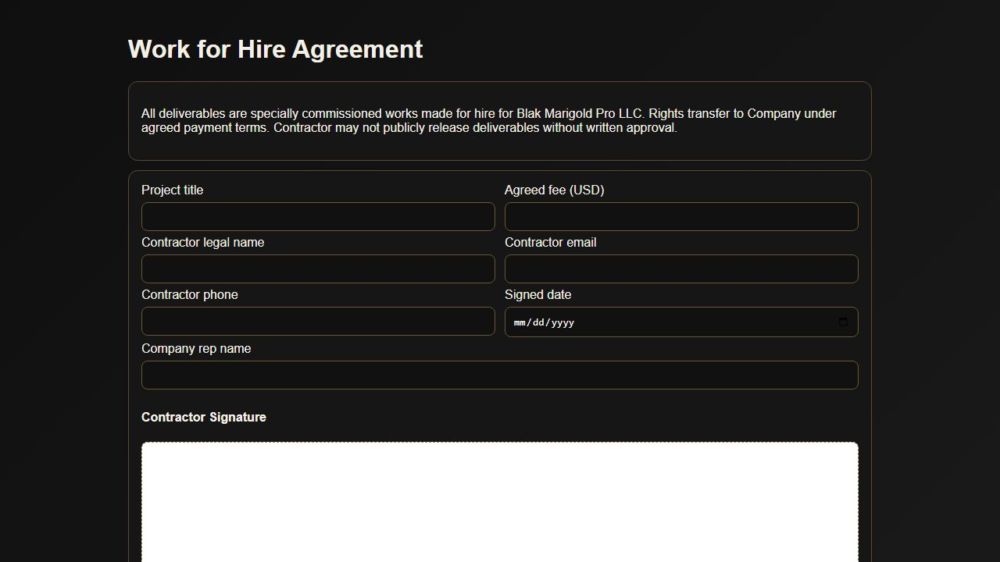

# Split Sheet Open Sign

Fast local and LAN signing app for music paperwork.

Main goal
When a song is finished, open this app, capture splits quickly, collect signatures, and immediately send copies to all parties.

## UI Screenshots

### Home


### Split Sheet flow


### Sync Collaboration Agreement


### Work for Hire Agreement


## Current Features
- Split Sheet
- Sync Collaboration Agreement
- Work for Hire Agreement
- Mobile friendly drawn signatures
- Optional per-signer invite links with secure tokens
- Per-signer status fields (invite sent, viewed, signed)
- Split validation: Writer shares must total 100 and Publisher shares must total 100
- Auto versioning for split sheets by song title
- Local storage in `data/submissions/*.json`
- Email notifications to studio + contributors + selected recipients (if SMTP configured)
- Final locked PDF packet generation when all signatures are complete
- Admin login to review submissions, signer status, send reminder emails, and download JSON/PDF
- Audit fields: timestamp, request IP, user agent, checksum on final packet

## Fast Studio Workflow
1. Open `/split-sheet`
2. Enter song/session details
3. Add contributors
4. Use `Set equal splits for all` then adjust if needed
5. Choose signing mode
   - In-session signing now, or
   - Invite links for each signer
6. Confirm recipients
7. Submit and send copies

## Setup
1. Copy `.env.example` to `.env`
2. Fill SMTP values and admin credentials
3. Run:

```powershell
cd C:/Users/User/Documents/Openclaw/split-sheet-open-sign
npm install
npm run dev
```

Local URL: `http://localhost:5050`
LAN URL: `http://<your-computer-ip>:5050`

## Important Security Note
Change default admin credentials before real use.
Do not expose this app publicly without a reverse proxy, TLS, and stronger auth.

## Recommended Next Upgrades (to make it truly industry ready)
1. Add signer status timeline with viewed timestamps
2. Add reminder emails for unsigned contributors
3. Add reusable templates for common split patterns and role presets
4. Add publishing export formats (CSV, PRO-ready fields)
5. Add cloud storage + backup strategy for legal records
6. Add optional e-sign vendor integration if you need stronger legal enforceability in some jurisdictions

## Environment
See `.env.example` for SMTP and admin settings.
