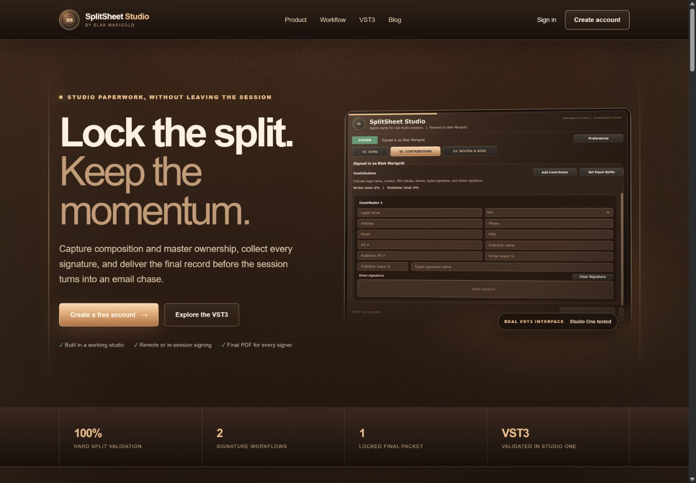
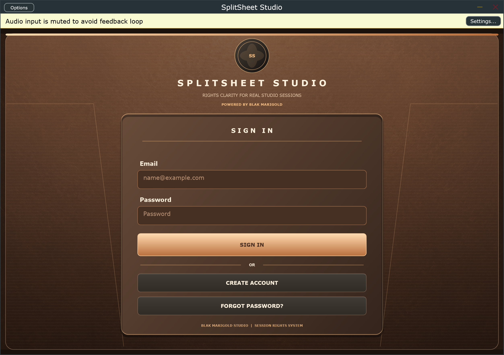
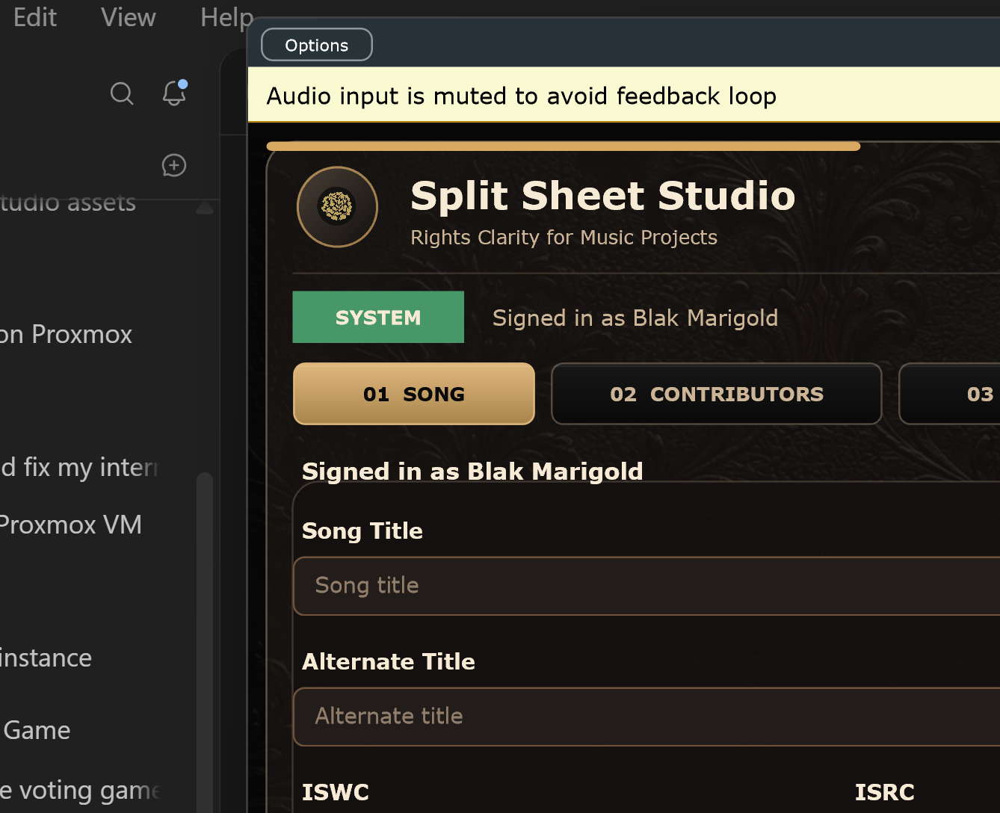
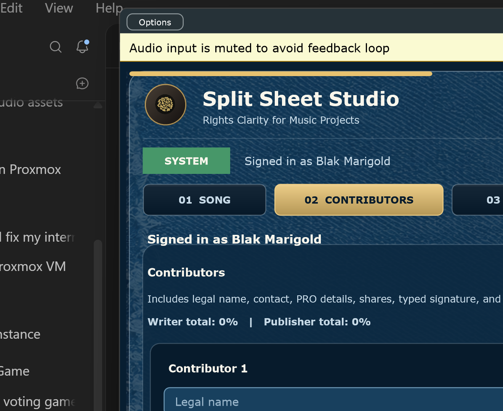
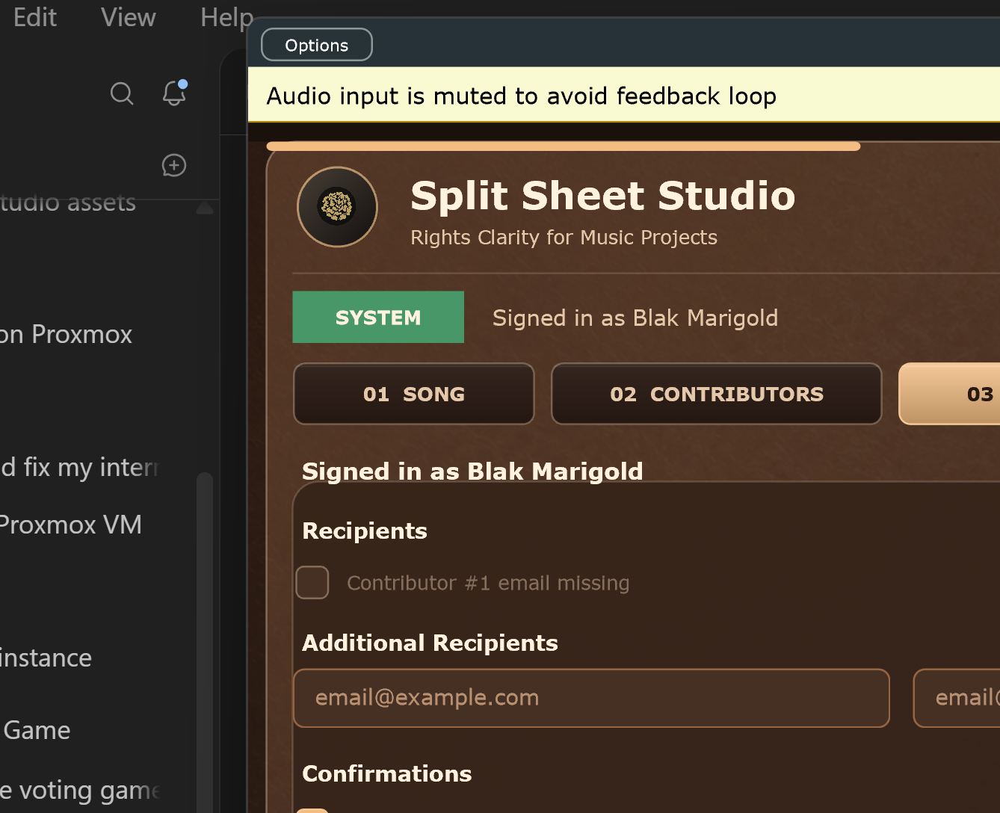
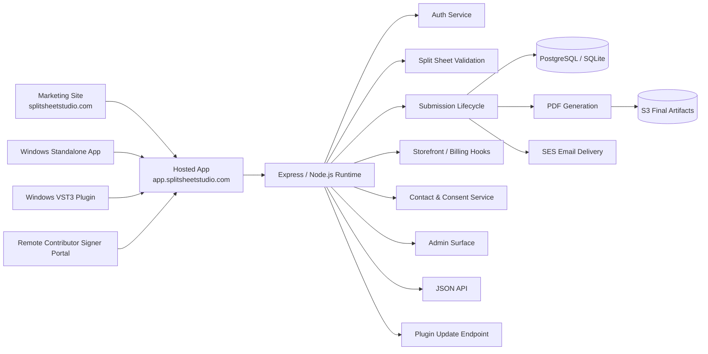

# Split Sheet Studio

Split Sheet Studio is a full-stack music-rights product for creating split sheets, collecting signatures, validating ownership percentages, delivering final PDF records, and exposing the same workflow through both a hosted web app and a native Windows VST3 / standalone client.

<p align="center">
  
</p>

## Product Snapshot

- Public site: `https://splitsheetstudio.com`
- Hosted app: `https://app.splitsheetstudio.com`
- Main workflow: split-sheet capture, invite-based signatures, final PDF generation, email delivery, revision links, admin review
- Native client: JUCE-based Windows standalone app and Windows VST3 plugin
- Current public packaging: Windows beta installer with hosted update metadata

## What This Repo Demonstrates

This repository is positioned as an employer-facing systems project, not only a prototype. It shows:

- product design around a real music-industry workflow problem
- full-stack application delivery from UI through persistence and cloud deployment
- native desktop / plugin integration against the same hosted backend
- operational thinking around legal surfaces, audit history, rate limiting, email delivery, and release packaging
- content and growth work through landing pages, pricing pages, blog infrastructure, and onboarding flows

## The Problem

Music sessions often end with verbal ownership agreements but no reliable operational record. That creates downstream problems for artists, producers, writers, engineers, managers, publishers, sync teams, and release managers.

Split Sheet Studio closes that gap by turning end-of-session rights capture into a structured workflow that can happen:

- in the browser
- inside the DAW on Windows
- remotely through secure contributor email links

## Screens

### Hosted Website

<p>
  
</p>

### Plugin Login

<p>
  
</p>

### Plugin Song Screen

<p>
  
</p>

### Plugin Contributors Screen

<p>
  
</p>

### Plugin Review And Send Screen

<p>
  
</p>

## Core Workflow

1. A user signs in through the hosted app or Windows plugin.
2. The user creates a split sheet with song metadata, rights scope, contributor details, ownership percentages, and recipients.
3. The server validates ownership totals and required legal fields.
4. The workflow either captures signatures in-session or sends secure invite links to remote contributors.
5. Each contributor reviews the same split data, agrees, and signs.
6. After the last required signature, the server generates the final PDF packet, records audit metadata, and emails the completed record to the selected recipients.
7. If a completed split needs changes later, the requester uses a revision link to start a new version while the prior signed record remains preserved.

## Architecture


```mermaid
flowchart LR
    A[Marketing Site<br/>splitsheetstudio.com] --> B[Hosted App<br/>app.splitsheetstudio.com]
    C[Windows Standalone App] --> B
    D[Windows VST3 Plugin] --> B
    E[Remote Contributor Signer Portal] --> B

    B --> F[Express / Node.js Runtime]
    F --> G[Auth Service]
    F --> H[Split Sheet Validation]
    F --> I[Submission Lifecycle]
    F --> J[Storefront / Billing Hooks]
    F --> K[Contact & Consent Service]

    I --> L[(PostgreSQL / SQLite)]
    I --> M[PDF Generation]
    M --> N[(S3 Final Artifacts)]
    I --> O[SES Email Delivery]

    F --> P[Admin Surface]
    F --> Q[JSON API]
    F --> R[Plugin Update Endpoint]
```

## Stack

### Application

- `Node.js`
- `Express`
- `EJS`
- `PDFKit`
- `Nodemailer`
- `SQLite` for local-first and test workflows
- `PostgreSQL` for hosted persistence
- `Redis` session / rate-limit store support
- `Stripe` integration hooks for plan checkout
- `JOSE` for OAuth token verification groundwork

### Native Client

- `JUCE`
- Windows `VST3`
- Windows standalone desktop build
- hosted API client for auth, split submission, and update checks
- embedded texture-based skin system with Bronze, Paper Thin, Denim, Soft, Speakeasy, and Plush themes

### Infrastructure

- `AWS Route 53`
- `AWS Certificate Manager`
- `Application Load Balancer`
- `Amazon ECS Fargate`
- `Amazon ECR`
- `Amazon RDS for PostgreSQL`
- `Amazon ElastiCache for Redis`
- `Amazon S3`
- `Amazon SES`
- `AWS Secrets Manager`
- `Amazon CloudWatch Logs`
- `IAM`

### Local / Edge Deployment Paths

- local Node development runtime
- Docker-based local execution path
- Proxmox LXC deployment scripts for private LAN hosting

## Key Technical Capabilities

- split-sheet creation with composition, master, or combined rights scope
- writer, publisher, and master percentage validation
- secure invite-based signature collection
- finalization only after all required contributors sign
- PDF generation and durable artifact storage
- completion email delivery to contributor and recipient lists
- requester-only revision link flow that creates a new version without overwriting the prior signed record
- plan-aware account usage and upgrade surfaces
- plugin update metadata endpoint and Windows download flow
- admin surface for reviewing signer status, revision lineage, reminder activity, and delivery state
- marketing opt-in and transactional-vs-marketing contact capture boundaries

## Repository Map

### Core Product

- [`server.js`](./server.js) - Express runtime, routing, auth/session setup, API endpoints, delivery, signer workflow, plugin update metadata
- [`services/auth-service.js`](./services/auth-service.js) - registration, login, verification, password reset, session token flows
- [`services/split-sheet-service.js`](./services/split-sheet-service.js) - payload normalization and rights validation
- [`services/submission-service.js`](./services/submission-service.js) - submission persistence and versioning
- [`services/plan-service.js`](./services/plan-service.js) - plan definitions and usage summaries
- [`services/contact-service.js`](./services/contact-service.js) - consent-aware contact collection and email preference state
- [`services/storefront-service.js`](./services/storefront-service.js) - plugin purchase and gated download support

### Web UI And Content

- [`views/`](./views/) - landing, pricing, account, auth, signer, admin, legal, beta, and blog templates
- [`public/`](./public/) - styles, product assets, and landing/plugin imagery
- [`content/blog-posts.js`](./content/blog-posts.js) - SEO blog data source
- [`content/legal-pages.js`](./content/legal-pages.js) - terms, privacy, refunds, e-sign, and disclaimer content

### Plugin

- [`vst/src/PluginEditor.cpp`](./vst/src/PluginEditor.cpp) - main Windows plugin and standalone UI workflow
- [`vst/src/PluginProcessor.cpp`](./vst/src/PluginProcessor.cpp) - plugin processor state and persistence
- [`vst/src/ApiClient.cpp`](./vst/src/ApiClient.cpp) - hosted auth, split submission, and update check transport
- [`vst/installer/`](./vst/installer/) - Windows installer packaging

### Deployment And Operations

- [`Dockerfile`](./Dockerfile) - hosted container runtime
- [`docker-compose.yml`](./docker-compose.yml) - local container path
- [`deploy/aws/`](./deploy/aws/) - ECS deployment scripts and task definition rendering
- [`deploy/proxmox/`](./deploy/proxmox/) - Proxmox deployment path
- [`docs/`](./docs/) - release, QA, deployment, beta, security, launch, and automation docs

## Authentication And Access

Current production-ready auth in the app:

- email/password registration and login
- email verification
- password reset
- account session management
- plugin login against the hosted app

Groundwork exists for:

- Google OAuth
- Apple OAuth

Those provider flows still need live production credentials and consent-screen configuration before they are launch-ready.

## Billing And Plans

The app already contains internal plan definitions and Stripe-ready upgrade hooks:

| Plan | Price | Limit | Intended Use |
| --- | --- | ---: | --- |
| Free | `$0` | `3` split sheets / month | testing and low-volume creators |
| Creator | `$5/mo` | `25` split sheets / month | independent artists, producers, and writers |
| Studio Pro | `$20/mo` | `250` split sheets / month | studios, engineers, and higher-volume teams |

Stripe can be connected later without changing the plan model already built into the account and pricing surfaces.

## Delivery And Audit Model

Important behavioral details already implemented:

- split-sheet drafts are separate from submitted split sheets
- secure signer tokens expire and can be reissued
- contributors must explicitly agree before signature submission
- finalization happens only after every required signer completes the workflow
- completion emails include a revision path for the original requester
- completed records remain immutable; revisions create a new version instead of altering the signed source

## Testing

Local smoke coverage exercises the main system path end to end:

- app health and ready endpoints
- signup, verification, login, refresh, logout, password reset
- split validation
- draft creation and update
- invite-based split creation
- secure signer flow
- final PDF generation
- revision-link flow
- account usage / limit enforcement
- plugin update metadata endpoint

Run locally:

```powershell
cd "C:\Users\BlakM\OneDrive\Documents\Split Sheet App\repo"
npm install
npm test
```

## Local Development

```powershell
cd "C:\Users\BlakM\OneDrive\Documents\Split Sheet App\repo"
npm install
npm run dev
```

Default local URL:

- `http://localhost:5050`

## Current Release Position

As of Monday, August 24, 2026, the product is materially beyond prototype stage:

- hosted site is live
- hosted app is live
- blog and legal surfaces are live
- Windows standalone app works
- Windows VST3 plugin works
- split-sheet email delivery works
- revision flow exists
- update metadata exists
- admin review surface exists

Still pending before a polished commercial release:

- live Stripe configuration
- production Google / Apple auth credentials
- signed Windows binaries and installer
- a public Mac build path if AU or macOS support becomes a release target
- deeper monitoring / alerting beyond current logs and runtime checks

## Documentation

- [`docs/public-launch.md`](./docs/public-launch.md)
- [`docs/public-beta-release.md`](./docs/public-beta-release.md)
- [`docs/qa-checklist.md`](./docs/qa-checklist.md)
- [`docs/release-checklist.md`](./docs/release-checklist.md)
- [`docs/email-automation.md`](./docs/email-automation.md)

## Summary

Split Sheet Studio is a productized rights-workflow system for music sessions. This repo demonstrates full-stack web engineering, cloud deployment, native plugin integration, document generation, workflow automation, operational thinking, and product packaging around a real vertical problem.
