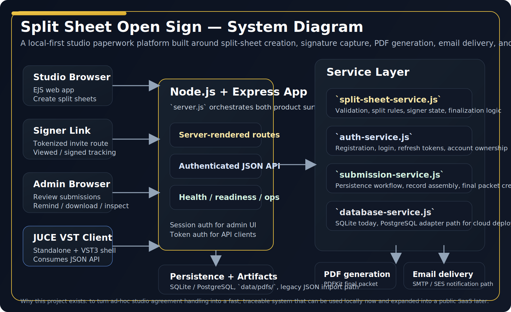

# Architecture

## Overview
This application is a server-rendered Node.js workflow tool for creating and completing studio paperwork, with split sheets as the primary product surface.

The design goal is simple: ship a fast, reliable internal tool with enough operational maturity to be useful immediately, while leaving obvious upgrade paths toward stronger production infrastructure later.

It was made to address a real studio operations problem: verbal agreement on splits is common, but reliable paperwork capture is not. The architecture reflects that practical goal by optimizing for speed of use, traceability, and gradual hardening over time.

## Stack
- Node.js
- Express
- EJS server-rendered templates
- SQLite persistence by default, with PostgreSQL provider support
- PDF generation via PDFKit
- SMTP delivery via Nodemailer
- Session-based admin auth via `express-session`
- Token-based auth for API and plugin clients
- JUCE-based standalone / `VST3` client in `vst/`

## Top-level architecture
### Client surfaces
- Browser-based studio workflow
- Tokenized signer-link workflow
- Admin review dashboard
- JUCE standalone / `VST3` plugin client

### Shared backend
All clients ultimately rely on the same backend responsibilities:
- auth and identity
- split-sheet validation
- submission persistence
- signer state transitions
- PDF generation
- email delivery

## Core workflow model
### 1. Split sheet creation
- User enters song and contributor data
- Server validates required fields
- Server validates writer and publisher shares total 100 each
- Submission is persisted
- Workflow branches into:
  - immediate completion for in-session signing, or
  - `pending-signatures` for invite-based signing

### 2. Invite-based signer flow
- Each contributor gets a unique signer token
- Signer opens `/split-sheet/sign/:id/:token`
- First page open stamps `viewedAt`
- Signature submission stamps `signedAt`
- When all signers complete, server generates final PDF and sends completion email if SMTP is configured

### 3. Admin flow
- Admin authenticates via session login
- Admin reviews submissions and signer progress
- Admin can inspect payload data, download PDFs, copy signer links, and send reminders to pending signers

### 4. API and plugin flow
- API clients authenticate via token-based login
- Drafts and finalized split sheets use the same validation logic as the web app
- The JUCE client consumes those endpoints without re-implementing business rules

## Data model
### Current database-backed model
Current primary persistence includes:
- user accounts
- auth sessions
- submissions

### Submission payload
Each submission stores:
- submission id
- type
- status
- owner identity
- created and updated timestamps
- request metadata
- workflow payload

### Contributor signer fields
For split sheets, each contributor may include:
- identity/contact fields
- role
- share allocations
- signer token
- invite sent timestamp
- viewed timestamp
- reminder sent timestamp
- signed timestamp
- typed signature name
- signature image data

## Artifact generation
### Stored artifacts
- database-backed submission records
- split sheet final PDF: `data/pdfs/split-sheet-<id>-final.pdf`
- legacy JSON import and compatibility paths retained for migration support

### Finalization behavior
When a split sheet reaches full signature completion:
- final packet is generated
- checksum is computed
- checksum is stored back into the submission payload
- PDF becomes available for download from the admin flow and split PDF route

## Reliability posture
- `/health` provides quick process liveness check
- `/ready` provides lightweight readiness info including email configuration state
- SMTP is optional so the app can still preserve records even if email delivery is down
- reminder actions are pragmatic and internal-tool friendly

## Security posture
Current protections are intentionally pragmatic rather than enterprise-grade:
- session auth for admin routes
- token auth for API routes
- login throttling for admin login
- tokenized signer URLs
- secure-cookie option via environment config
- audit metadata on submissions and final packets

## Design tradeoffs
### Why server-rendered UI
A server-rendered EJS app keeps complexity low, startup fast, and maintenance simple for an internal operations product.

### Why SQLite first
SQLite is transparent, easy to inspect, easy to back up, and fast to ship for single-studio or local-first use.

### Why tokenized links instead of accounts
Per-signer links remove account friction and better match the “finish the paperwork quickly” use case.

### Why add the plugin client
The plugin is not just a novelty surface. It is a product bet that the best place to complete this workflow may be inside the DAW session itself. The architecture therefore keeps the API usable by both the browser app and the plugin shell.

## Future evolution path
If taken beyond internal/local-first use, the most natural next steps would be:
- stronger auth and role separation
- managed PostgreSQL in production
- object storage for generated artifacts
- rate limiting and broader API hardening
- more reliable plugin UX for signature capture
- multi-tenant studio and team models
