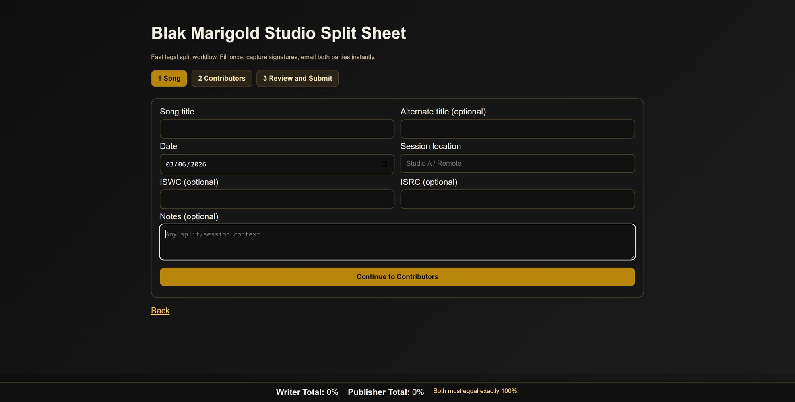
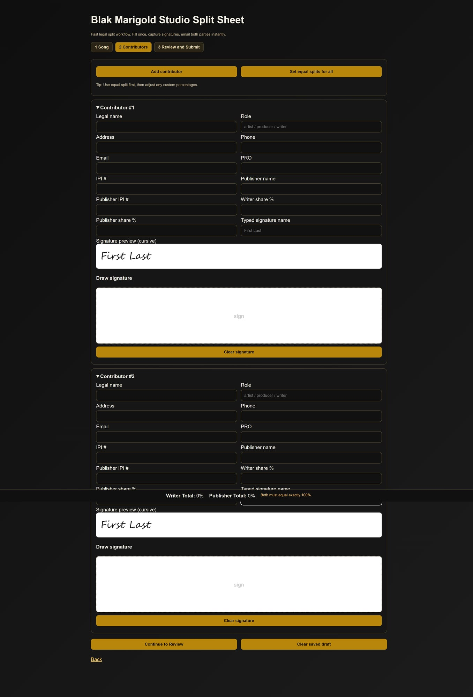
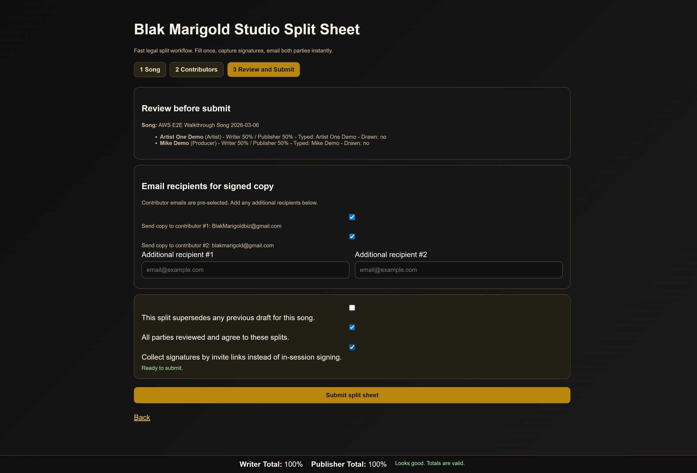
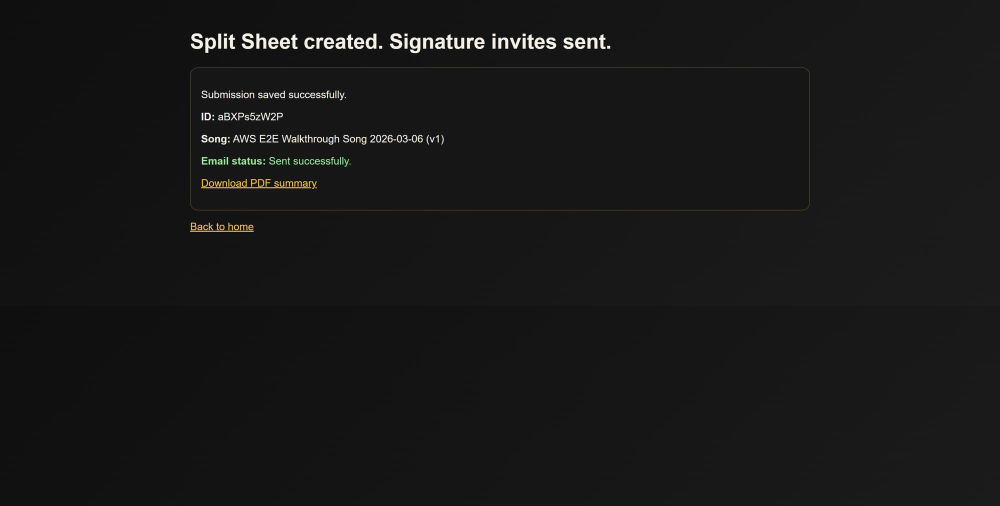
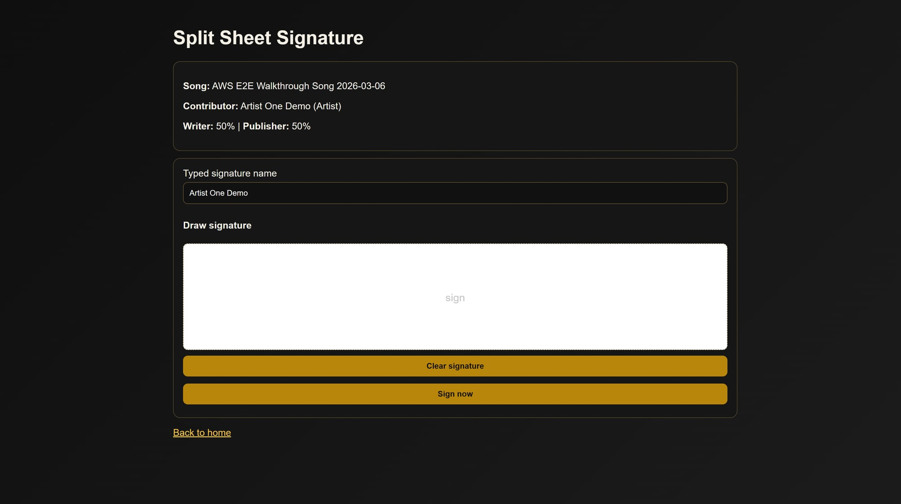
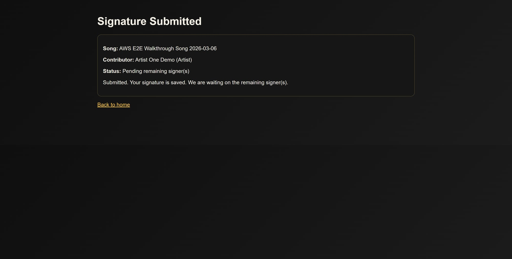
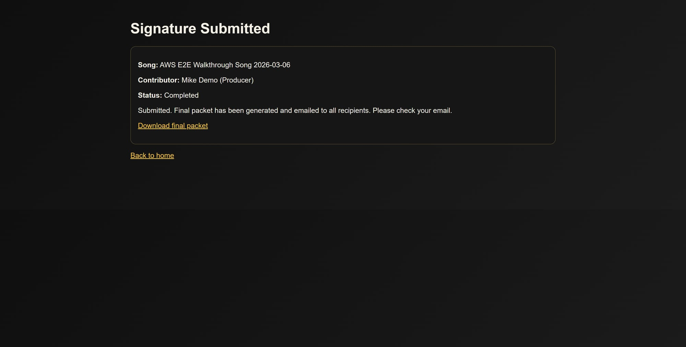

# Split Sheet Invite-Signature E2E Walkthrough

This walkthrough demonstrates the full 2-signer split-sheet flow in production style:

- Artist #1 creates the split
- Both signers receive email invite links
- Signer #1 signs and sees pending status
- Signer #2 signs and sees completion status
- Final packet is generated and emailed to recipients

## Why this exists (problem -> solution)

### Problem
Studios often handle split sheets in text threads, screenshots, and manual follow-ups. That creates missing signatures, unclear percentages, and no clean audit trail.

### Solution
This project provides a guided, browser-based split workflow with invite links + signer-specific pages + automatic completion output.

---

## End-to-end tested flow (with screenshots)

### 1) Song details page

What happens:
- Artist #1 enters song/session metadata.
- User advances to contributor setup.

### 2) Contributor setup page

What happens:
- Legal/contact/split details are entered for both signers.
- Split percentages are configured to valid totals.

### 3) Review and submit page

What happens:
- Final split summary is reviewed.
- Recipient emails are selected.
- Invite-signature mode is enabled.

### 4) Submission created + invite emails sent

What happens:
- Submission ID is generated.
- Email status confirms invite dispatch.

### 5) Signer #1 opens secure link

What happens:
- Signer sees song + role + split percentages.
- Signs via touch/mouse canvas and submits.

### 6) Signer #1 submission confirmation (pending)

What happens:
- UI confirms signature saved.
- Status indicates waiting on remaining signer.

### 7) Signer #2 opens secure link

What happens:
- Signer #2 sees same split context and signs.

### 8) Signer #2 completion confirmation

What happens:
- Workflow is completed.
- Final packet generation + email delivery confirmation shown.

---

## Notes on email behavior

- Invite emails include signer-specific secure URLs.
- Completion email is sent to selected recipients.
- Split summary table is embedded in signer invite and completion email content.

---

## AWS readiness checklist (next step)

To prepare this app for AWS deployment:

1. **Runtime + process**
   - Use EC2 or ECS/Fargate for Node app runtime.
   - Run behind Nginx or ALB.

2. **Storage**
   - Move local `data/` documents to S3 (PDFs + submission artifacts).
   - Keep metadata in DynamoDB or PostgreSQL.

3. **Secrets**
   - Move `.env` secrets to AWS Secrets Manager or SSM Parameter Store.
   - Rotate SMTP credentials.

4. **Session + auth**
   - Replace memory session store with Redis/ElastiCache.
   - Keep admin auth protected by strong password policy.

5. **Email**
   - Prefer AWS SES for reliable outbound delivery at scale.
   - Keep branded templates for invite + completion.

6. **Domain + TLS**
   - Use Route53 + ACM certificate + HTTPS-only ALB.

7. **Observability**
   - CloudWatch logs/metrics.
   - Alert on email failures and pending-signature backlog.

8. **Background jobs**
   - Schedule reminder jobs via EventBridge + worker queue.

9. **Security hardening**
   - Restrict CORS/origin.
   - Add rate limits and CSRF protections.
   - Sanitize all inputs and file outputs.

10. **CI/CD**
   - GitHub Actions -> deploy pipeline (staging then production).

This gives a production-grade, recruiter-friendly workflow from intake to signed completion.
