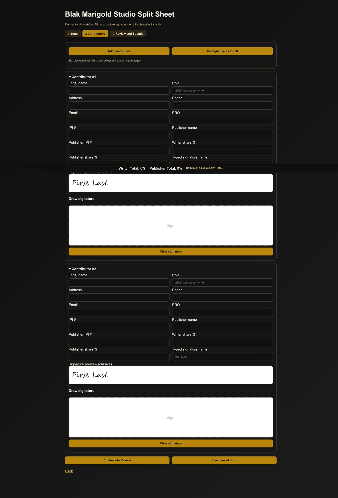
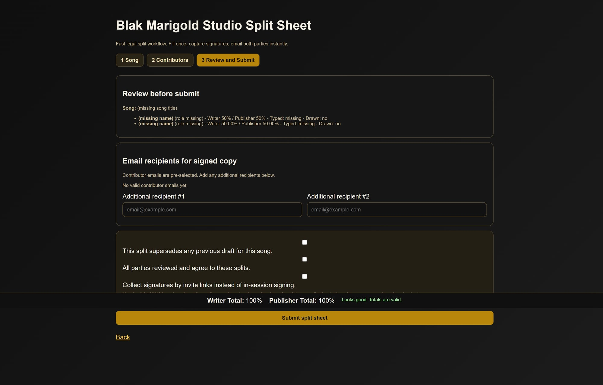

# Split Sheet 3-Step Walkthrough (Tested)

This walkthrough was re-tested after fixing the step-navigation JavaScript issue.

## Step 1 — Song Details

What is happening:
- User enters song/session metadata (title, date, location, codes, notes)
- Clicks **Continue to Contributors** to move into signer setup

## Step 2 — Contributors + Signature Inputs

What is happening:
- User adds contributor legal/contact + split details
- Signature canvases are active and ready for drawn signatures
- User can set equal splits quickly and continue to review

## Step 3 — Review and Submit

What is happening:
- User reviews all split/signature state
- Selects recipients and agreement checkboxes
- Submits split sheet for PDF generation + email delivery

---

Notes:
- This flow was validated locally after patching JS that previously blocked step navigation.
- Email delivery status is shown on success page (sent / SMTP not configured / failed).
